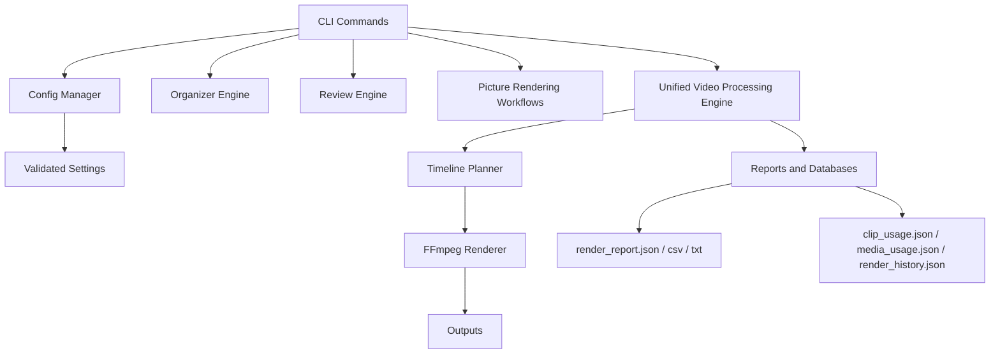

# ISKCON NRJD Video Editor


Production-focused, headless media automation toolkit for devotional event content.

This project helps you organize, review, and render high-quality videos from local media folders using a CLI-first workflow and FFmpeg.

## What This Project Does

- Organizes event media into production-ready buckets.
- Supports interactive manual review before rendering.
- Renders short-form and long-form outputs from pictures.
- Renders short-form and long-form outputs from source videos using one unified rendering engine.
- Tracks media usage and render history to reduce repetition.
- Generates render reports in JSON, CSV, and TXT formats.

## Tech Stack

<p align="center">
  
  
  
  
  
  
  
  
  
  
  
  
  
</p>

### Core Language and Runtime
- Python 3.12+

### CLI and Terminal UX
- Typer
- Rich

### Media and Rendering
- FFmpeg and FFprobe
- OpenCV (opencv-python)
- Pillow
- NumPy

### Configuration and Logging
- PyYAML
- python-dotenv
- Loguru

### Utilities and Quality
- tqdm
- ImageHash
- pytest
- ruff
- black
- PyInstaller (packaging)

## Project Architecture (High-Level)



## Folder Structure

```text
config/                  Application configuration
docs/                    Documentation and examples
input/                   Organized event input media
output/                  Rendered outputs, reports, logs, failed jobs
src/                     Application source modules
tests/                   Unit tests
build_windows.py         Windows packaging script
build_macos.py           macOS packaging script
main.py                  CLI entrypoint
```

## Setup Guide

## Setup on macOS

1. Install prerequisites.

```bash
xcode-select --install
brew install python ffmpeg
```

2. Clone and enter the project directory.

```bash
git clone <your-repo-url>
cd inrjd_VideoEditingTool
```

3. Create and activate a virtual environment.

```bash
python3 -m venv .venv
source .venv/bin/activate
```

4. Install dependencies.

```bash
pip install --upgrade pip
pip install -r requirements.txt
```

5. Verify tools.

```bash
ffmpeg -version
ffprobe -version
python3 main.py --help
```

6. (Optional) Run tests.

```bash
PYTHONPATH=. python3 -m pytest -q
```

## Setup on Windows

1. Install prerequisites.
- Install Python 3.12+ from python.org.
- Install FFmpeg and ensure ffmpeg.exe and ffprobe.exe are available in PATH.

2. Clone and enter the project directory.

```powershell
git clone <your-repo-url>
cd inrjd_VideoEditingTool
```

3. Create and activate a virtual environment.

```powershell
py -3.12 -m venv .venv
.\.venv\Scripts\Activate.ps1
```

4. Install dependencies.

```powershell
python -m pip install --upgrade pip
pip install -r requirements.txt
```

5. Verify tools.

```powershell
ffmpeg -version
ffprobe -version
python main.py --help
```

6. (Optional) Run tests.

```powershell
set PYTHONPATH=.
python -m pytest -q
```

## Configuration

- Main config file: config/config.yaml
- Example profile overrides: docs/sample-config.yaml

Important configuration sections:
- render: workers, encoder preference, ffmpeg path
- shorts and long: resolution, fps, durations
- audio: music, fade, loudness, volume, crossfade
- transitions: transition enablement and duration
- video_render: color presets, transition probabilities, stabilization, profile overrides

## Step-by-Step CLI Workflow

Run these in order for a normal production flow.

1. Check version and environment.

```bash
python main.py version
```

2. Organize media into event buckets.

```bash
python main.py organize --all
```

Optional organizer commands:

```bash
python main.py organize --event "2026-Sample-Festival"
python main.py organize --event "2026-Sample-Festival" --copy
python main.py organize --event "2026-Sample-Festival" --move
python main.py organize --event "2026-Sample-Festival" --link
```

3. Review media interactively.

```bash
python main.py review --all
```

Optional review commands:

```bash
python main.py review --event "2026-Sample-Festival"
python main.py review --event "2026-Sample-Festival" --resume
python main.py review --event "2026-Sample-Festival" --type shortform_videos
python main.py review --event "2026-Sample-Festival" --filter-videos
python main.py review --event "2026-Sample-Festival" --filter-low-quality
python main.py review --event "2026-Sample-Festival" --filter-duplicates
python main.py review --event "2026-Sample-Festival" --filter-portrait-images
python main.py review --event "2026-Sample-Festival" --filter-landscape-images
```

4. Render short videos from pictures.

```bash
python main.py render-shorts-pictures --event "2026-Sample-Festival"
```

5. Render long video from pictures.

```bash
python main.py render-long-pictures --event "2026-Sample-Festival"
python main.py render-long-pictures --event "2026-Sample-Festival" --profile cinematic-festival
```

6. Render short videos from source videos (unified video engine).

```bash
python main.py render-short-videos --event "2026-Sample-Festival"
python main.py render-short-videos --event "2026-Sample-Festival" --profile fast-preview
python main.py render-short-videos --event "2026-Sample-Festival" --dry-run
```

7. Render long video from source videos (unified video engine).

```bash
python main.py render-long-videos --event "2026-Sample-Festival"
python main.py render-long-videos --event "2026-Sample-Festival" --profile cinematic-festival
python main.py render-long-videos --event "2026-Sample-Festival" --dry-run
```

8. Inspect outputs and reports.

- Render outputs: output/shorts and output/long
- Reports: output/reports
- Failed jobs: output/failed
- Thumbnails: output/thumbnails

## Full CLI Command List

```bash
python main.py version
python main.py organize
python main.py review
python main.py render-shorts-pictures
python main.py render-long-pictures
python main.py render-short-videos
python main.py render-long-videos
```

Use --help on every command:

```bash
python main.py <command> --help
```

## Reports and Databases Generated

Under output/reports:
- render_report.json
- render_report.csv
- render_report.txt
- clip_usage.json
- media_usage.json
- render_history.json

## Packaging

Windows executable build:

```bash
python build_windows.py
```

macOS app build:

```bash
python build_macos.py
```

## Developer Details

- Project: ISKCON NRJD Video Editor
- Maintainer Organization: ISKCON NRJD
- Core Engineering: ISKCON NRJD Tech Team
- QA and Validation: ISKCON NRJD Media Team

### 📫 Let's Connect

<p align="center">
  <a href="https://www.linkedin.com/in/krishnakayaking/"></a>&nbsp;
  <a href="https://www.youtube.com/@TechieKrishnaKayaking"></a>&nbsp;
  <a href="https://www.techiekrishnakayaking.com/"></a>&nbsp;
  <a href="https://topmate.io/techie_krishna_kayaking"></a>&nbsp;
  <a href="https://www.instagram.com/techiekrishnakayaking/"></a>&nbsp;
  <a href="https://play.google.com/store/apps/details?id=co.diaz.ycvkc&hl=en_IN"></a>
</p>

---

## Project Footer

<p align="center">
  
</p>

<p align="center">
  <strong>License details:</strong><br/>
  MIT License. See LICENSE for complete terms.
</p>

<p align="center">
  <strong>Developed by ISKCON NRJD Tech Team & Tested by ISKCON NRJD Media team.</strong>
</p>

<p align="center">
  <a href="https://www.iskconnrjd.com/"></a>&nbsp;
  <a href="https://www.instagram.com/iskconbangalorenrjd/"></a>&nbsp;
  <a href="https://www.youtube.com/channel/UCmoGsHHJiAhRql3mKJnX_bw"></a>&nbsp;
  <a href="https://www.facebook.com/ISKCONBANGALORENRJD/"></a>
</p>
